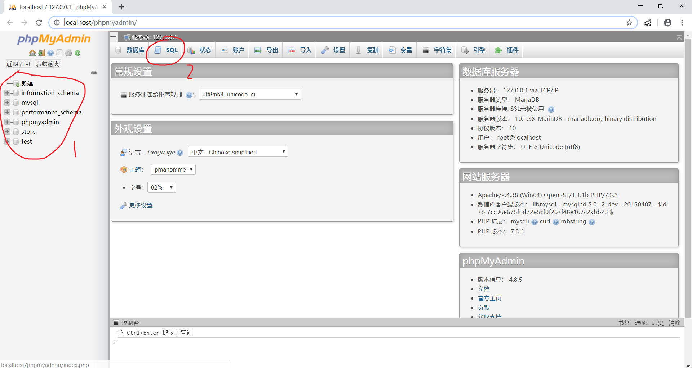
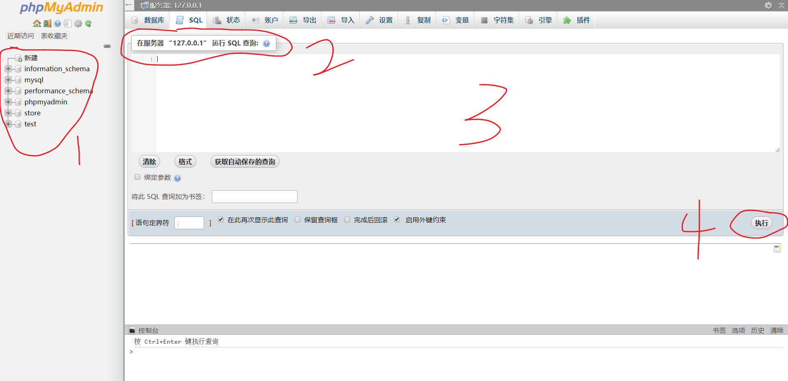
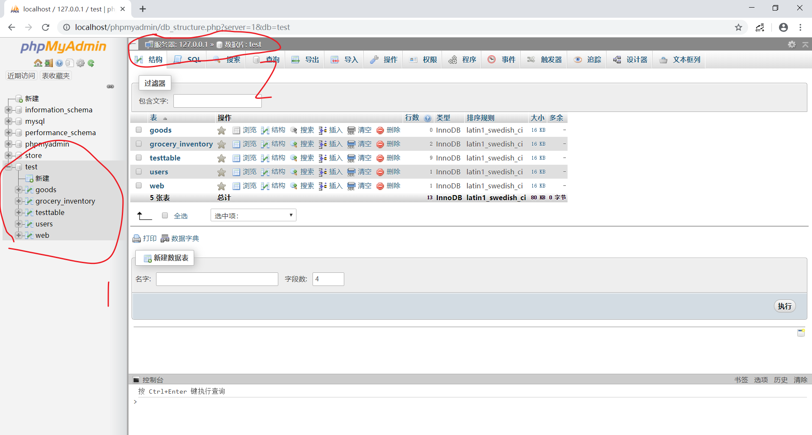
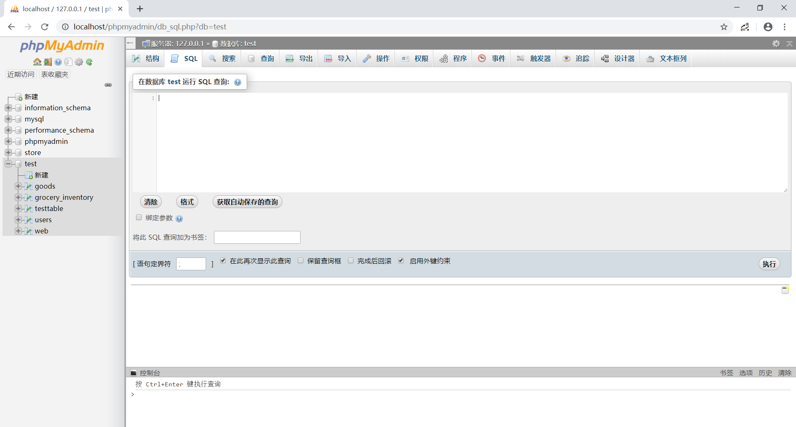

# 关于MySQL的使用

## 主页

1. 布局如下：
2. 关键点：
   * 标记1：该部分是数据库结构的目录，可以在此查看数据库的各个库，各个表，以及表的各个列
   * 标记2：SQL，点进去可以进入MySQL指令控制台界面，可使用sql指令对数据库进行操作，接下来的部分主要介绍这部分的使用方法

## SQL界面

1. 布局如下：
2. 关键点：
    * 标记1：此处可以选择在哪一个层级进行操作
      * 服务器层：可对数据库进行操作，如创建一个库，删除一个库
      * 数据库层：可对数据库中的表进行操作，如创建一个表，查询表中数据等等，我们的主要操作在这个层级进行
    * 标记2：此处显示了你目前处在的层级，如上图，我们处在服务器层，在此处可以用sql指令创建一个新的数据库，也能删除旧的库
    * 标记3：此处就是我们输入sql语句的地方，有不完全的**代码补全**功能，**对大小写不敏感**
    * 标记4：完成代码后，可以点击这个按钮执行这些语句

## 具体操作

仅限于本次项目需要的简单操作，其他操作请自行摸索

1. 进入该界面以后，在右边的目录中点击想创建表格的数据库，即可进入该数据库中
    * 标记1：此处可看到数据库中有哪些表
    * 标记2：你当前所在位置
2. 点击上方sql进入控制台界面
3. 将以下代码复制粘贴到控制台上
    ~~~
    create table Users(
            user_id int auto_increment primary key,
            user_name varchar(50) not null,
            user_password varchar(50) not null,
            user_email varchar(50) not null,
            user_sex bit,
            user_real_name varchar(50),
            user_department varchar(50),
            user_major varchar(50),
            user_grade bit,
            user_contact varchar(50),
            user_style bit default 0,
            user_text tinytext,
            user_time date,
            user_record timestamp
    )
    ~~~

4. 点击执行，即可成功创建一个表

## 与php连接

1. 连接代码

    ~~~<php>
    function __construct() {
                $server="localhost";//主机
                $db_username="root";//数据库用户名
                $db_password="qin";//数据库密码
                $db_name='test';//数据库的名字
                $this->conn = mysqli_connect($server,$db_username,$db_password);//链接数据库
                if(!$this->conn){
                die("we can't connect bro".mysqli_error($this->conn));//如果链接失败输出错误 die()退出脚本
                }
                mysqli_select_db($this->conn , $db_name);//选择数据库(数据库名)

                //不知道在干什么，似乎是让数据库能识别中文编码
                mysqli_query($this->conn , "SET NAMES utf-8");
            }
    ~~~

2. 把上方代码中的这些参数改成你的服务器上对应的参数，即可连接到数据库

    ~~~<php>
        $server="localhost";//主机
        $db_username="root";//数据库用户名
        $db_password="qin";//数据库密码
        $db_name='test';//数据库的名字
    ~~~