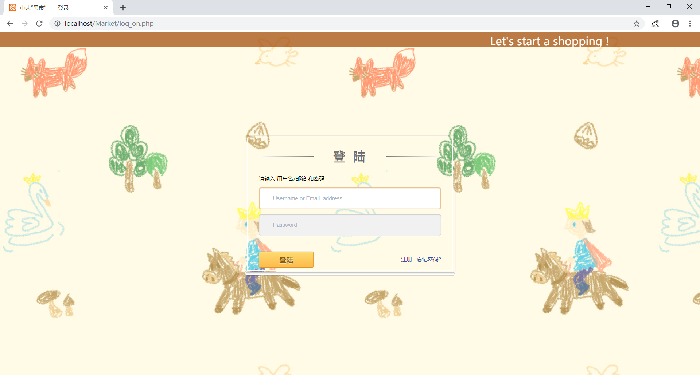
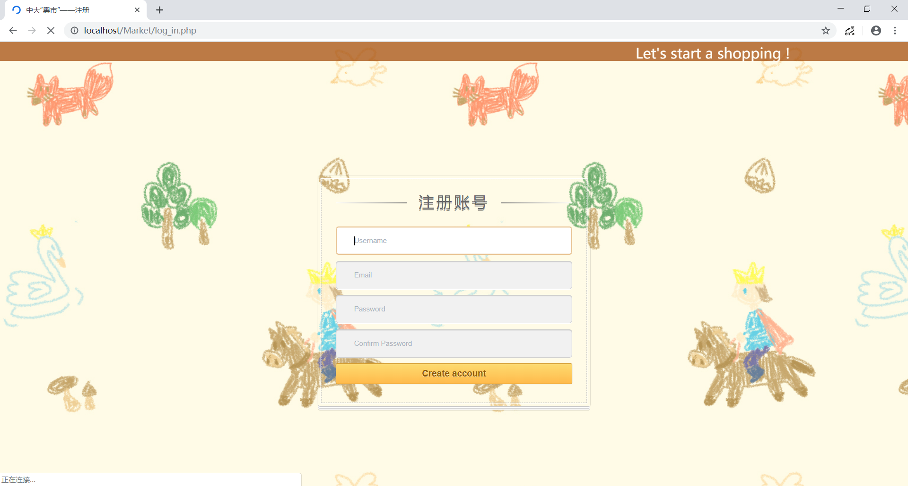
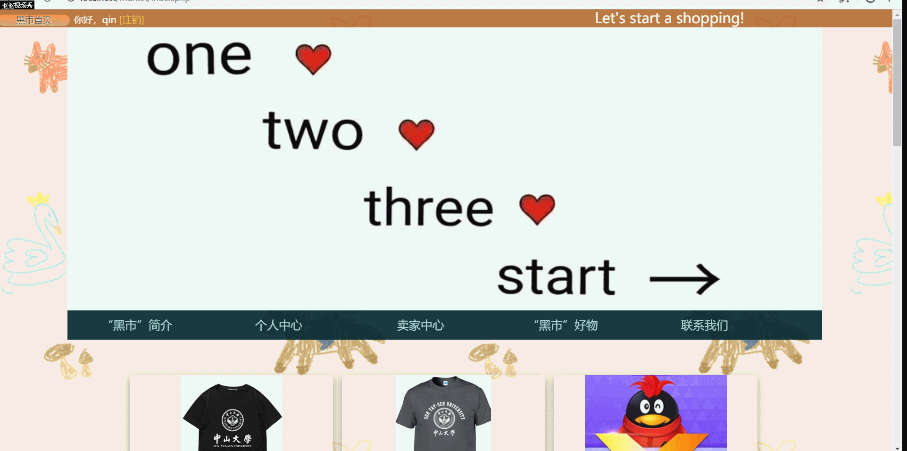
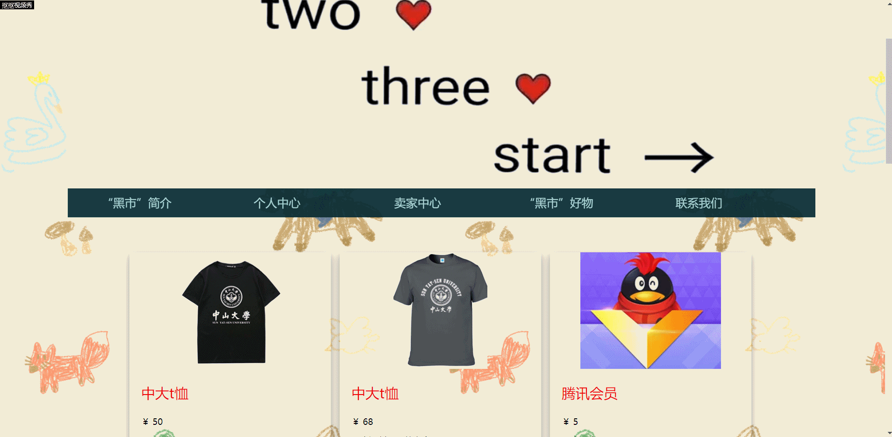
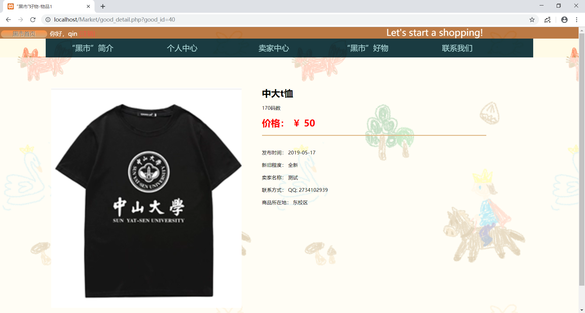
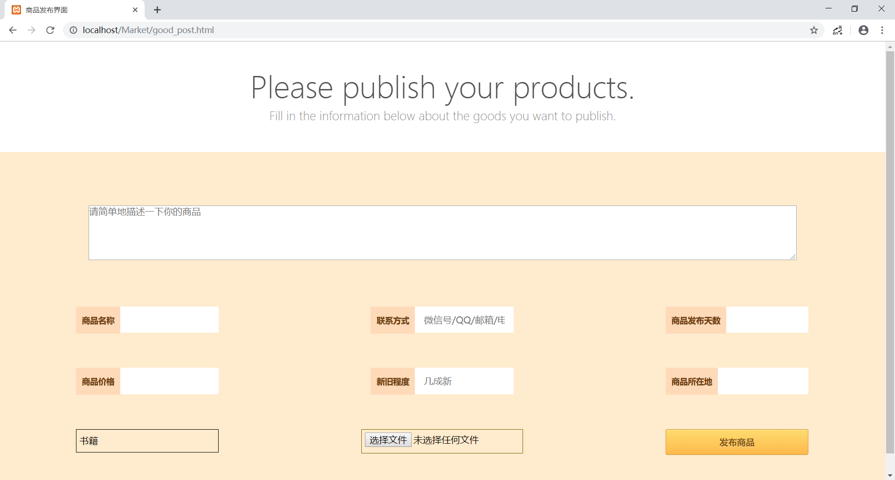
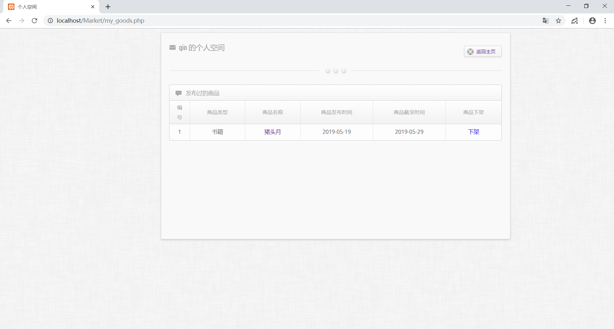

# 中大黑市项目成果展示

## 项目目的

进入大学以来，我经常会听到以前同学在讨论他们学校的黑市，以及其中物美价廉的学习用品和热情的学长学姐。这种有趣东西常常让我感到十分羡慕。而在羡慕之余，我又不禁感到疑惑。为什么中大没有类似的组织呢？难道中大的学生就没有这方面的需要吗？

直到最近，我在朋友圈闲置物品交易群的推送以后，我才发现原来中大也是有这种组织的，不过规模没有其他学校那么大罢了。进到群里以后，我才发现这样的基于微信群的交易实际上真的局限性很大。如果你没有及时关注群里的商品信息，就很容易错过你想要的商品。而且，在这样的微信群里，能够进行交易的商品也是很少的。在这样的一种局限性巨大平台上，也难怪这些交易群很难真正发展起来了。  

那么中大的学生对闲置物品交易的需求大不大呢？我认为是很大的 ~~不然也不会有那么多人和我看到一篇推送就被骗进那个实际上毫无作用的交易群里~~。用我比较了解的医学生的情况来举例，在中大，一个医学生一年需要花在购买教材，工具书和各类器材的钱几乎达到千元。然而，如果他们认识高年级学长，并从学长手里购买那些已经被闲置的器材的话，他们能够省下数百元的费用。这还只是在学习这一个方面。实际的生活中，我们也经常会攒下一些已经于我们而言已经失去价值却弃之可惜的商品~~譬如那些还没怎么翻过的课本~~。如果能够把这些东西交易出去，廉价地交易给我们以后的学弟学妹，那样不就既能解放我们自己的空间，又能让这些东西重新发挥价值了吗。  

因此，我认为中大学生对闲置物品交易的需求是很大的，不过由于一直没有一个很好的平台，所以这项有意义的活动才一直无法顺利地大规模地展开。
基于以上地想法，我觉得有必要发挥我们的专业能力为这样一项活动搭建一个适合的平台——一个能让中大学生自由发布商品信息、检索需要的商品的网站。

## 项目功能

我们的网站的最主要的功能，就是实现**交易信息的发布与获取**。实际的物品交易过程，将由买家与卖家在**线下进行**，网站的作用仅仅是为双方搭建起交流的桥梁。

## 项目开发环境

* 开发工具：vscode，xampp(强烈安利这款软件，傻瓜式搭建服务器与数据库)
* 开发语言
  * 前端：HTML，CSS，JavaScript
  * 后端：PHP，MySQL *听说是比较简单的后端开发组合，实际学起来也难度不大*

---

> 以下是我们项目最终的成果，相关代码在**code**文件夹中,如果会搭服务器的话可以试着运行

## 登陆界面 *lon_on.php*

### 功能说明

1. 已经注册过的用户可以输入自己的**用户名/邮箱**以及**密码**完成登陆，进入黑市主页
2. 还未注册过的用户可以点击登录框右下角的注册按钮进入注册页面，注册一个新的账号
3. 若登陆出错，我们会通过输入框上方的小字提醒用户错误原因

### 界面外观

## 注册界面 *log_in.php*

### 功能说明

1. 用户输入**用户名**，**邮箱**和**密码**进行注册
2. 每个用户名和注册邮箱都只能是唯一的，如果曾经被使用过了，将收到注册失败的提醒
3. 注册成功后，页面就会跳转到主页

### 界面外观

## 黑市主页 *index.php*

### 功能说明

1. 黑市主页的最上端打印出了用户的登陆信息，用户可以在此点击**注销**退出登陆，返回登陆界面
2. 主页中间的功能菜单上，展示出了网站的主要功能（部分还未实现）。点击即可进入相应页面
   1. 黑市简介
      1. 黑市功能
      2. 黑市发源
   2. 个人中心（未实现）
      1. 我的私信
      2. 我的信息
   3. 卖家中心
      1. 商品发布
      2. 我的商品
   4. 黑市好物（商品分区）
      1. 书籍
      2. 电子产品
      3. 学习用品
      4. 生活用品
      5. 其他
   5. 联系我们
      1. 联系我们
      2. 我要投诉
3. 在功能菜单下方，我们打印出了12件最新发布的商品，发布时间越晚，位置越靠前

### 界面外观

1. 页面上部:

    

2. 页面下部：

    

## 商品分区页面 *type_good.php*

### 功能说明

1. 不同分区会展示出不同类型的商品
2. 被点击次数越多的商品，位置会越靠前

### 界面外观

1. 书籍分区

    

2. 分区页面跳转
   
    

## 商品详细信息界面 *good_detail.php*

### 功能说明

1. 在首页或者分区中点击商品的**图片**或是**名字**都可以进入商品详细信息界面
2. 详细信息页面中会展示出商家的所在地和联系方式，用户可根据这些信息找到商家进行线下交易

### 界面外观

## 商品发布界面 *good_post.html*

### 功能说明

1. 用户填写完该页面的表单后，点击发布按钮，即可发布自己的商品
2. 若是发布失败，页面会做出提醒

### 界面外观

## 我的商品界面 *my_good.php*

### 具体功能

1. 用户可以在此对自己发布过的商品进行管理
2. 点击商品名称可以跳转到该商品的详细信息页面
3. 点击下架即可撤回这个商品

### 页面外观

---

更具体的功能展示请观看展示视频：
[中大黑市](https://github.com/qinyusheng/Market-of-SYSU/blob/master/video/%E4%B8%AD%E5%A4%A7%E9%BB%91%E5%B8%82.mp4)
