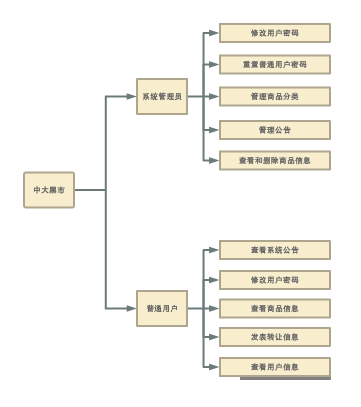

# 中大黑市

## 项目目的
进入大学以来，我经常会听到以前同学在讨论他们学校的黑市，以及其中物美价廉的学习用品和热情的学长学姐。这种有趣东西常常让我感到十分羡慕。而在羡慕之余，我又不禁感到疑惑。为什么中大没有类似的组织呢？难道中大的学生就没有这方面的需要吗？

直到最近，我在朋友圈闲置物品交易群的推送以后，我才发现原来中大也是有这种组织的，不过规模没有其他学校那么大罢了。进到群里以后，我才发现这样的基于微信群的交易实际上真的局限性很大。如果你没有及时关注群里的商品信息，就很容易错过你想要的商品。而且，在这样的微信群里，能够进行交易的商品也是很少的。在这样的一种局限性巨大平台上，也难怪这些交易群很难真正发展起来了。  

那么中大的学生对闲置物品交易的需求大不大呢？我认为是很大的 ~~不然也不会有那么多人和我看到一篇推送就被骗进那个实际上毫无作用的交易群里~~。用我比较了解的医学生的情况来举例，在中大，一个医学生一年需要花在购买教材，工具书和各类器材的钱几乎达到千元。然而，如果他们认识高年级学长，并从学长手里购买那些已经被闲置的器材的话，他们能够省下数百元的费用。这还只是在学习这一个方面。实际的生活中，我们也经常会攒下一些已经于我们而言已经失去价值却弃之可惜的商品~~譬如那些还没怎么翻过的课本~~。如果能够把这些东西交易出去，廉价地交易给我们以后的学弟学妹，那样不就既能解放我们自己的空间，又能让这些东西重新发挥价值了吗。  

因此，我认为中大学生对闲置物品交易的需求是很大的，不过由于一直没有一个很好的平台，所以这项有意义的活动才一直无法顺利地大规模地展开。
基于以上地想法，我觉得有必要发挥我们的专业能力为这样一项活动搭建一个适合的平台——一个能让中大学生自由发布商品信息、检索需要的商品的网站。

## 网站功能
我们的网站的最主要的功能，就是实现**交易信息的发布与获取**。实际的物品交易过程，将由买家与卖家在**线下进行**，网站的作用仅仅是为双方搭建起交流的桥梁。

## 项目工作流程
下图是我为本次项目的总制作过程设计的一个流程图，由于我们对Web制作的了解并不是很多，因此前期进度会比较慢。

## 网站功能
下图是我们此次的黑市网站~~希望能实现~~的功能  

## 功能流程
这一部分是我们理想中这个网站的使用流程。嗯，理想中的。

## 项目分工
* 项目负责人：秦裕胜  
* 前端（3人）：杨思源、母贺楠、罗炜乐  
* 后端（2人）：秦裕胜、孙广海  

## 开发工具
* 前端：html、css、JavaScript  
* 后端：PHP、MySQL、xampp