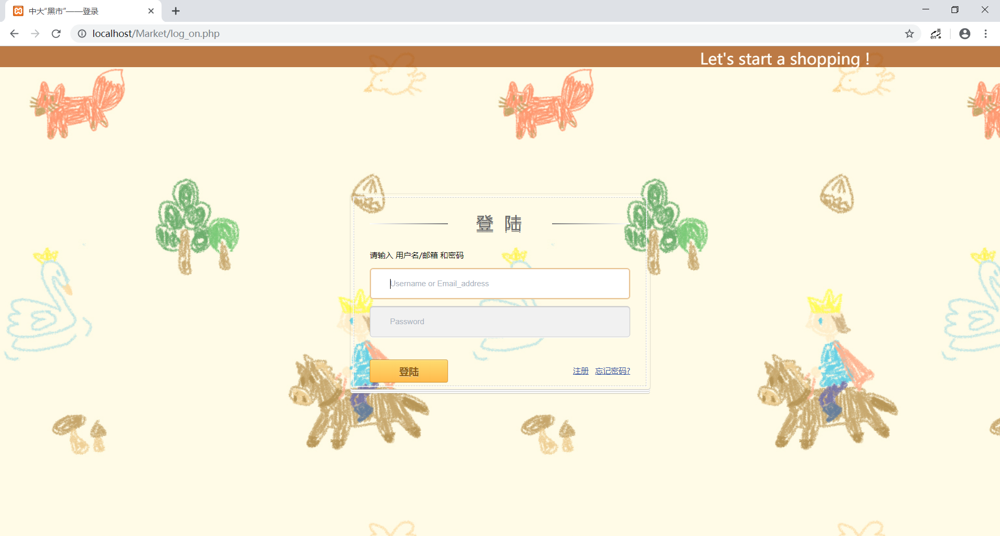
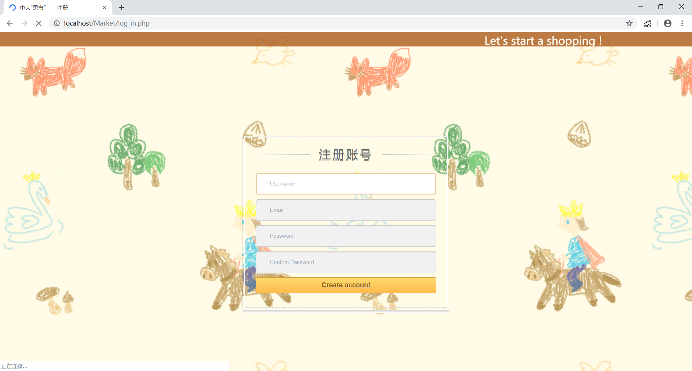
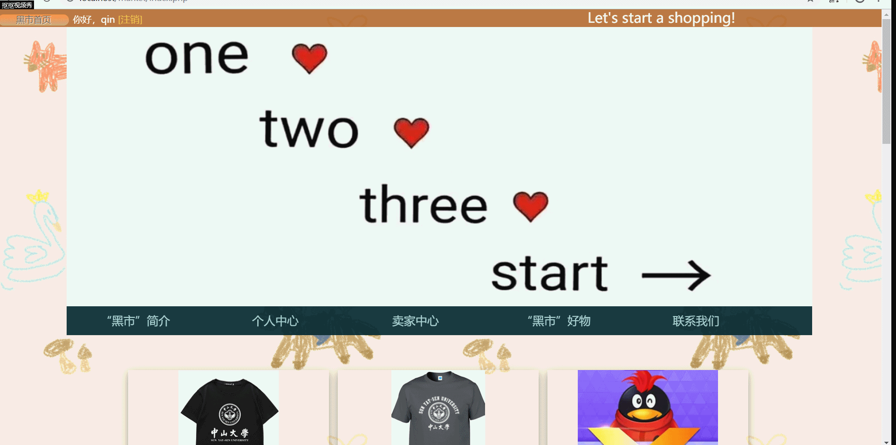
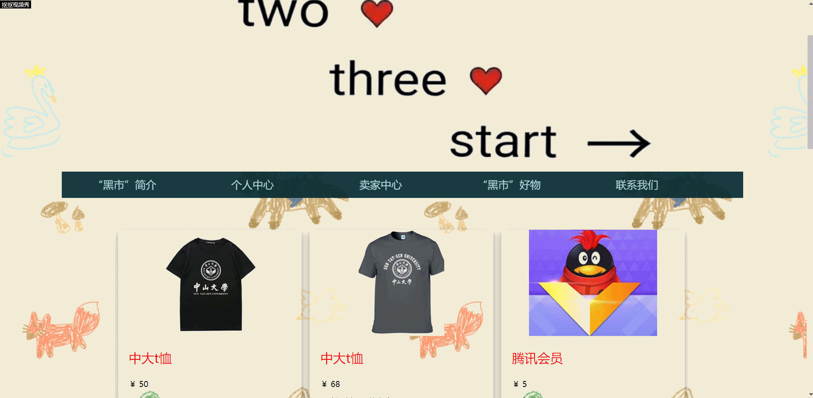
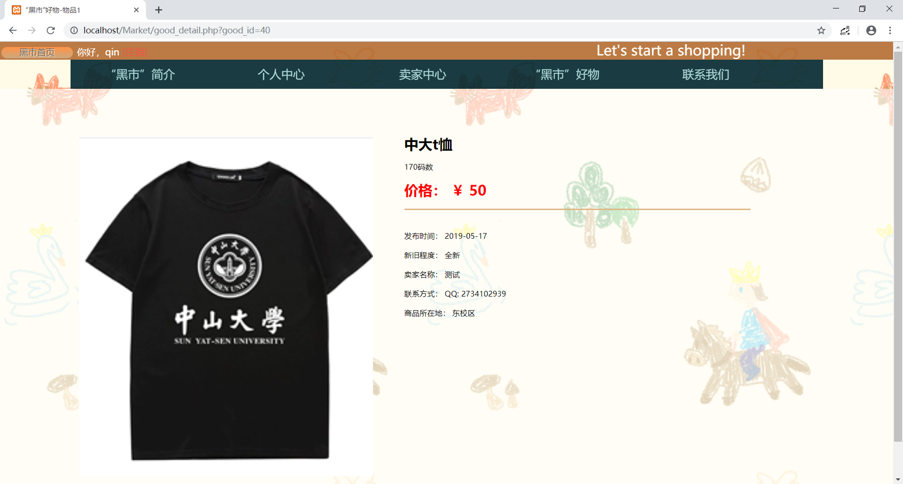
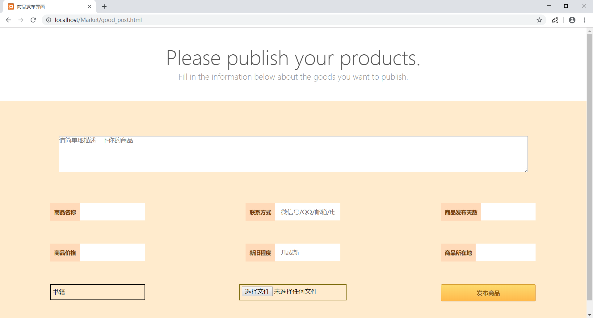

# ”中大黑市“项目成果展示

## 登陆界面

### 功能说明

1. 已经注册过的用户可以输入自己的**用户名/邮箱**以及**密码**完成登陆，进入黑市主页
2. 还未注册过的用户可以点击登录框右下角的注册按钮进入注册页面，注册一个新的账号
3. 若登陆出错，我们会通过输入框上方的小字提醒用户错误原因

### 界面外观

## 注册界面

### 功能说明

1. 用户输入**用户名**，**邮箱**和**密码**进行注册
2. 每个用户名和注册邮箱都只能是唯一的，如果曾经被使用过了，将收到注册失败的提醒
3. 注册成功后，页面就会跳转到主页

### 界面外观

## 黑市主页

### 功能说明

1. 黑市主页的最上端打印出了用户的登陆信息，用户可以在此点击**注销**退出登陆，返回登陆界面
2. 主页中间的功能菜单上，展示出了网站的主要功能（部分还未实现）。点击即可进入相应页面
   1. 黑市简介
      1. 黑市功能
      2. 黑市发源
   2. 个人中心（未实现）
      1. 我的私信
      2. 我的信息
   3. 卖家中心
      1. 商品发布
      2. 我的商品
   4. 黑市好物（商品分区）
      1. 书籍
      2. 电子产品
      3. 学习用品
      4. 生活用品
      5. 其他
   5. 联系我们
      1. 联系我们
      2. 我要投诉
3. 在功能菜单下方，我们打印出了12件最新发布的商品，发布时间越晚，位置越靠前

### 界面外观

1. 页面上部:

    

2. 页面下部：

    

## 商品分区页面

### 功能说明

1. 不同分区会展示出不同类型的商品
2. 被点击次数越多的商品，位置会越靠前

### 界面外观

1. 书籍分区

    

2. 分区页面跳转
   
    

## 商品详细信息界面

### 功能说明

1. 在首页或者分区中点击商品的**图片**或是**名字**都可以进入商品详细信息界面
2. 详细信息页面中会展示出商家的所在地和联系方式，用户可根据这些信息找到商家进行线下交易

### 界面外观

## 商品发布界面

### 功能说明

1. 用户填写完该页面的表单后，点击发布按钮，即可发布自己的商品
2. 若是发布失败，页面会做出提醒

### 界面外观

## 我的商品界面

### 具体功能

1. 用户可以在此对自己发布过的商品进行管理
2. 点击商品名称可以跳转到该商品的详细信息页面
3. 点击下架即可撤回这个商品

### 页面外观

---

更具体的功能展示请观看展示视频：
[中大黑市](https://github.com/qinyusheng/Market-of-SYSU/blob/master/video/%E4%B8%AD%E5%A4%A7%E9%BB%91%E5%B8%82.mp4)